# ZXtextAI · 智测未来

> **让测试回归价值 —— 一站式 · AI 原生 · 全链路智能测试平台**
>
> *"Upload a requirement, ship a full test campaign."*

<p align="center">
  
  
  
  
  
  
</p>

---

## 一、项目定位 · 我们要干掉什么

在传统研发流水线里，**测试环节是最脏、最累、最容易被压缩** 的一环：

- 需求评审 —— 靠人工逐字读，靠经验找漏洞；
- 用例编写 —— 手工敲 Excel、Xmind，一条一条堆；
- 自动化脚本 —— 每次 UI 改版就 **崩一半**；
- 测试报告 —— 加班到深夜手写周报日报……

**ZXtextAI 要做的，是用大模型 + Agent 把这一整条链路** ***全部重构*****。**

我们把「大模型」深度嵌入 **需求 → 用例 → 执行 → 报告** 的每一环，让测试同学从 *体力劳动* 中解放出来，把宝贵的注意力交还给 **判断、风险和策略** 本身。

> **一句话总结**
> **上传一份需求文档，几分钟内产出一份可直接执行的自动化测试用例集与专业级测试报告。**

---

## 二、平台价值 · 一张表看懂差异

| 场景         | 传统做法                           | ⚡ ZXtextAI 打法                                                            | 效率提升         |
| ------------ | ---------------------------------- | --------------------------------------------------------------------------- | ---------------- |
| 需求评审     | 会议室围坐、口头讨论、易漏易忘     | **AI 需求评审 Agent**：流式输出「完备性 / 可测性 / 风险点」结构化意见 | \~**10×** |
| 测试用例编写 | Excel/Xmind 手工敲，2 天写 50 条   | **AI 用例生成器**：文档+网页爬取 → 一键 Markdown 表格用例            | \~**20×** |
| 用例评审     | 二次人工复审、来回撕扯             | **双 AI 交叉评审 & 改进**：Writer→Reviewer→Refiner 三段流水线       | \~**8×**  |
| UI 自动化    | 手写 Selenium/Playwright，改版即崩 | **browser-use + LLM Agent**：AI 看着页面自己点，零脚本零维护          | \~**∞**         |
| APP 自动化   | Appium 手写、真机维护地狱          | **Airtest + Appium** 通道 + **可视化场景搭建器**                | \~**6×**  |
| 接口自动化   | Postman + 一堆脚本文件             | 平台内置**项目 / 环境 / 变量 / 断言 / 定时任务** 全栈能力             | \~**5×**  |
| 数据造数     | Faker + 一堆临时脚本               | **数据工厂**：20+ 内置工具（身份证/银行卡/签名/条码/MRZ...）          | \~**10×** |
| 测试报告     | Word 手撸、截图靠 QQ 传            | **步骤截图 + GIF 录屏 + Word/PDF 自动出具 + 飞书/邮件推送**           | \~**20×** |

> **结论**：把一次完整的测试活动，从「按天算」压缩到「按分钟算」。

---

## 三、核心能力矩阵

### 🧠 1. AI 需求分析中心

- 多格式输入：**PDF / Word / Markdown / TXT / URL** 一网打尽
- **流式思考可视化**（SSE），AI 的推理过程完全可见、可干预
- **三段式 AI 流水线**：`Writer 生成 → Reviewer 评审 → Refiner 改进`
- 一键**导入 UI 自动化模块**直接开跑，需求到执行零跳转

### 🌐 2. 零脚本 UI 自动化

- **全自动模式**：`browser-use` + LLM Agent，喂目标即可
- **半自动模式**：预生成用例 → 逐步执行 + 断点续跑
- 步骤级 **截图 / GIF / AI 描述** 全量归档
- 内置 **元素捕获器 / 页面对象管理 / Monaco 脚本编辑器**

### 📱 3. APP 自动化

- **Android / iOS 双端**（Airtest + Appium 双引擎）
- 设备池、APK 包管理、**可视化场景搭建器**
- UI 元素库沉淀，一次录制多端复用

### 🔌 4. 接口自动化

- 接口调试、环境切换、**变量提取 / JSONPath 断言 / Schema 校验**
- **定时任务**（Celery Beat + Croniter）
- 历史回放、失败重跑、通知钩子

### 🏭 5. 数据工厂

- **20+ 生产级造数工具**：身份证、银行卡、手机号、手写签名、二维码、条码、车牌、MRZ 护照码……
- **API + Web 双通道**，可直接嵌入测试流程
- 插件化架构，业务同学也能自扩展工具

### 🤖 6. AI 智能助手

- 全局 AI 对话入口，**任意页面** 唤起
- 支持 **Dify** / 自研 Agent 双通道
- 上下文感知、跨模块联动

### ⚙️ 7. 配置中心

- **多提供商聚合**：Moonshot / DeepSeek / OpenAI / Anthropic / Gemini / Ollama / Groq
- **提示词工程可视化**，Prompt 作为一等公民
- AI 智能模式一键切换：`快速 / 精细 / 深度`

### 🔐 8. 权限与通知

- **JWT + Session 双认证**，兼容 SPA 与后台管理
- 用户 / 角色 / 项目 三级权限
- 通知通道：**短信 · 邮件 · 飞书 · 钉钉**

---

## 四、技术栈 · 全栈现代化

### 🧩 后端（Python 生态天花板组合）

| 类别         | 选型                                                                | 为什么是它                         |
| ------------ | ------------------------------------------------------------------- | ---------------------------------- |
| Web 框架     | **Django 5.1 + DRF**                                          | 生态最完整、ORM 与权限模型开箱即用 |
| 异步 & 实时  | **Uvicorn + Daphne + Channels**                               | ASGI 原生、WebSocket / SSE 双支持  |
| 任务调度     | **Celery 5.3 + Redis 7 + Kombu**                              | 业界事实标准，可水平扩展           |
| 数据存储     | **MySQL 8** + PyMySQL                                         | InnoDB + utf8mb4，兼容性强         |
| AI 生态      | **LangChain + OpenAI/Anthropic/Gemini/Groq/Ollama SDK + MCP** | 多模型热切、协议前沿               |
| 浏览器自动化 | **Playwright 1.57 + browser-use 0.10 + Selenium 4.15**        | 三驾马车覆盖所有 UI 自动化场景     |
| APP 自动化   | **Airtest 1.4 + Appium 通道**                                 | 图像识别 + 控件识别双保险          |
| OCR / CV     | **easyocr + opencv + pytesseract + torch/torchvision**        | 中英双语识别、验证码识别           |
| 文档处理     | **python-docx / pypdf / reportlab / markdownify**             | 生成 Word、解析 PDF、导出 Markdown |
| 认证         | **SimpleJWT + PyJWT**                                         | 无状态 + 前后端解耦                |
| 数据校验     | **pydantic v2 + DRF Serializers**                             | 类型安全 + 极致性能                |
| API 文档     | **drf-spectacular（OpenAPI 3）**                              | 自动生成、Swagger UI 直出          |
| 造数         | **Faker + fakerx + python-barcode + qrcode**                  | 20+ 造数场景                       |

### 🎨 前端（Vue3 现代化工程范式）

| 类别       | 选型                                                 |
| ---------- | ---------------------------------------------------- |
| 框架       | **Vue 3.3**（Composition + Options 混合）      |
| 构建       | **Vite 6**（毫秒级 HMR）                       |
| 状态       | **Pinia 2**                                    |
| 路由       | **Vue Router 4**                               |
| UI 组件    | **Element Plus 2.3 + @element-plus/icons-vue** |
| 图表       | **ECharts 5 + vue-echarts**                    |
| 编辑器     | **Monaco Editor**（VSCode 同款内核）           |
| PDF 处理   | **pdfjs-dist + jspdf**                         |
| Excel 处理 | **xlsx**                                       |
| Markdown   | **marked**                                     |
| 国际化     | **vue-i18n 9**（中英双语覆盖 15+ 模块）        |
| HTTP       | **axios 1.5**（拦截器 / 重试 / SSE 适配）      |
| 拖拽       | **vuedraggable**                               |
| 通用工具   | **dayjs + lodash-es**                          |

### 🚀 DevOps / 部署

- **Docker + docker-compose** 一键起环境
- **Nginx** 反向代理 + 静态托管
- **GitHub Actions** 可扩展 CI/CD
- **Redis 7 + MySQL 8** 容器化持久层

---

## 五、七大杀手锏 · 我们凭什么与众不同

| #  | 特性                       | 通俗解释                                                    |
| -- | -------------------------- | ----------------------------------------------------------- |
| ① | **AI 用例流水线**    | 生成 → 评审 → 改进，SSE 流式输出，AI 干活你围观           |
| ② | **Token 智能降级**   | 上下文超限自动截断重试，8k/32k/128k 模型无感切换            |
| ③ | **零脚本 UI 自动化** | 大模型直接操控浏览器，"能用嘴描述就能跑"                    |
| ④ | **步骤级证据链**     | 每一步：截图 + AI 描述 + GIF 汇总 + Word 报告，随时甩锅     |
| ⑤ | **多模型热切换**     | 后台配 N 个模型，按角色（writer/reviewer/tester）自动挑最佳 |
| ⑥ | **可插拔造数**       | 数据工厂通过 `tool_list.py` 注册，业务同学也能扩展工具    |
| ⑦ | **中英双语 i18n**    | 前端国际化覆盖 15+ 模块，出海无压力                         |

---

## 六、系统架构 · 全景一张图

```
┌────────────────────────────────────────────────────────────────────┐
│                          用户（Web 浏览器）                        │
└──────────────┬─────────────────────────────────────┬───────────────┘
               │ HTTPS                                │ SSE / WebSocket
      ┌────────▼─────────┐                    ┌──────▼──────┐
      │   Nginx / Vite   │                    │   Daphne    │
      │  frontend/dist   │                    │   (ASGI)    │
      └────────┬─────────┘                    └──────┬──────┘
               │ /api/*                              │
      ┌────────▼─────────────────────────────────────▼──────────┐
      │                Django 5.1 + DRF · 业务中台                │
      │  ┌────────────┬────────────┬────────────┬────────────┐  │
      │  │ 需求分析    │ UI 自动化   │ APP 自动化  │ 接口自动化  │ │
      │  │ AI Pipeline│browser-use │  Airtest   │  Postman++  │ │
      │  ├────────────┼────────────┼────────────┼────────────┤  │
      │  │ 数据工厂    │ AI 助手     │ 配置中心    │ 权限 & 通知 │ │
      │  │  20+ Tools │ Dify/Agent │ Multi-LLM  │ JWT/RBAC   │ │
      │  └────────────┴────────────┴────────────┴────────────┘  │
      └─────┬───────────┬────────────┬───────────────┬──────────┘
            │           │            │               │
      ┌─────▼──┐  ┌─────▼─────┐  ┌───▼────┐   ┌──────▼─────────┐
      │MySQL 8 │  │  Redis 7  │  │Celery  │   │  LLM Providers │
      │  OLTP  │  │Cache/Queue│  │Worker  │   │ Moonshot/DS/GPT│
      └────────┘  └───────────┘  └────────┘   │ Claude/Gemini  │
                                              │ Ollama/Groq…   │
                                              └────────────────┘
```

**架构关键词**：**分层清晰 · ASGI 全异步 · 事件驱动 · 多模型可插拔 · 水平可扩**

---

## 七、产品截图 · Product Showcase

> 一图胜千言。以下截图取自真实运行环境，涵盖需求分析、用例生成、UI 自动化、APP 自动化、接口测试、数据工厂、报告中心等核心模块。

<table>
  <tr>
    <td width="50%" align="center">
      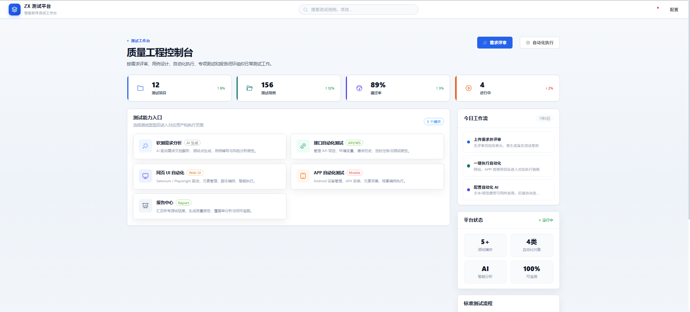<br/>
      <sub><b>① 平台首页 · Dashboard 概览</b></sub>
    </td>
    <td width="50%" align="center">
      <br/>
      <sub><b>② AI 需求分析 · 流式解析中</b></sub>
    </td>
  </tr>
  <tr>
    <td width="50%" align="center">
      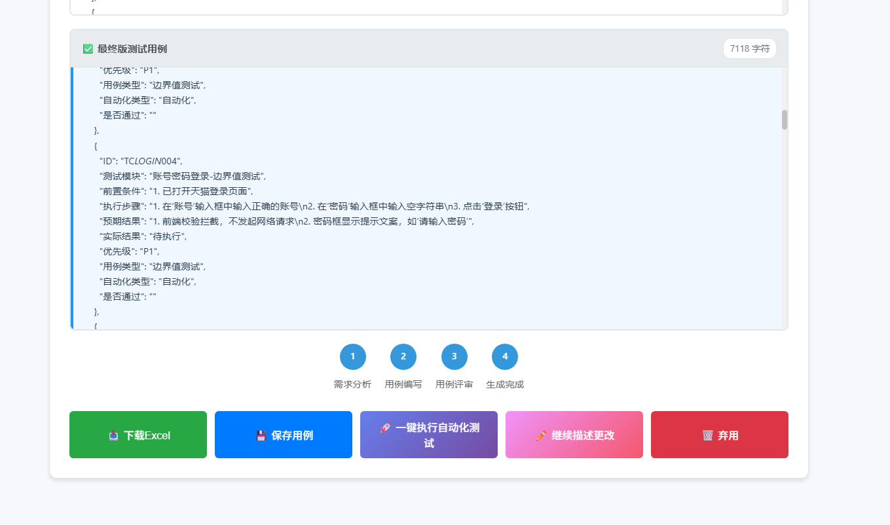<br/>
      <sub><b>③ AI 用例生成 · 入口配置</b></sub>
    </td>
    <td width="50%" align="center">
      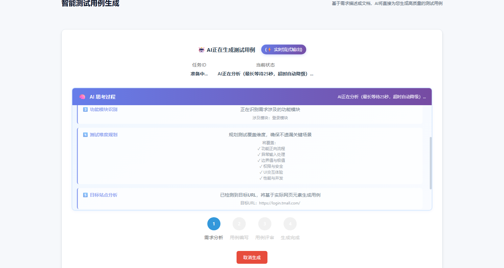<br/>
      <sub><b>④ AI 用例生成 · 流式思考过程</b></sub>
    </td>
  </tr>
  <tr>
    <td width="50%" align="center">
      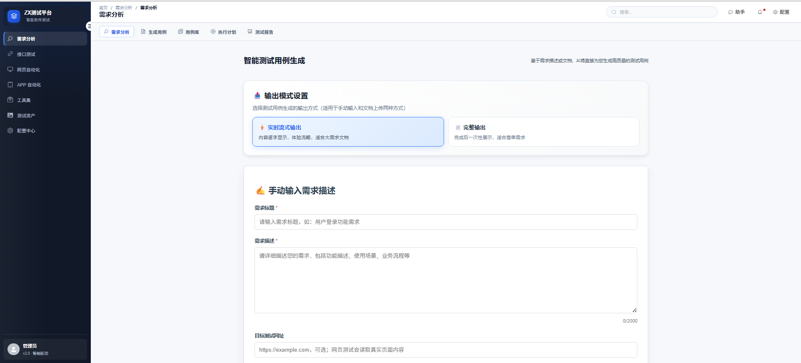<br/>
      <sub><b>⑤ 双 AI 交叉评审 · 三段流水线</b></sub>
    </td>
    <td width="50%" align="center">
      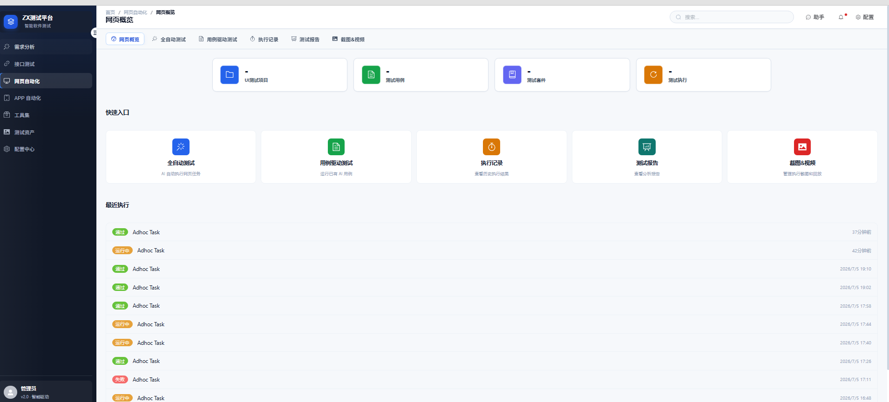<br/>
      <sub><b>⑥ UI 自动化 · browser-use Agent</b></sub>
    </td>
  </tr>
  <tr>
    <td width="50%" align="center">
      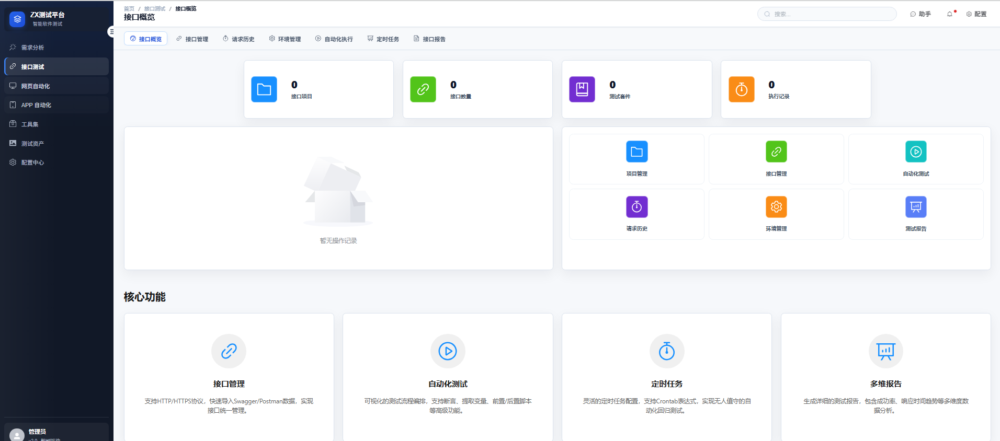<br/>
      <sub><b>⑦ 接口自动化 · 调试与断言</b></sub>
    </td>
    <td width="50%" align="center">
      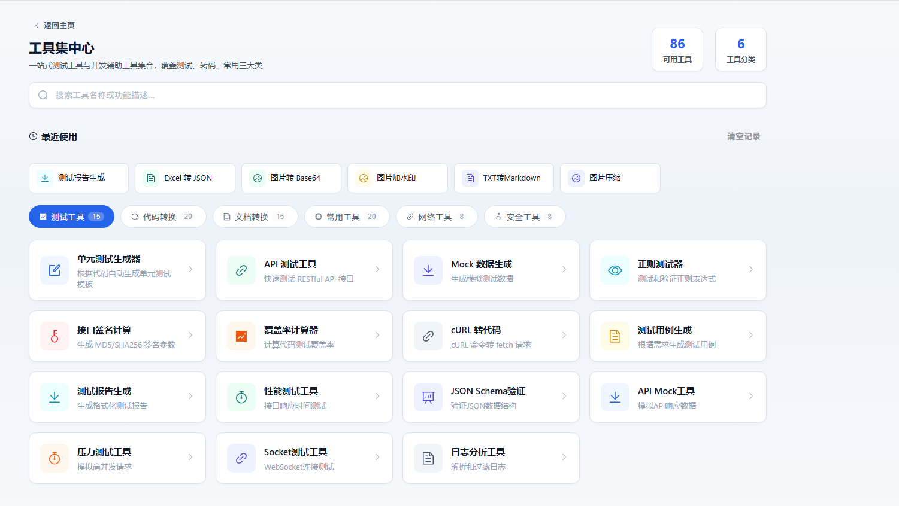<br/>
      <sub><b>⑧ 数据工厂 · 20+ 造数工具集合</b></sub>
    </td>
  </tr>
  <tr>
    <td width="50%" align="center">
      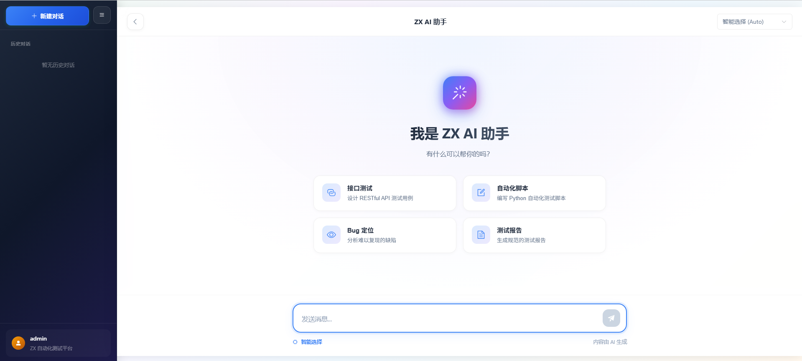<br/>
      <sub><b>⑨ AI 智能助手 · 对话入口</b></sub>
    </td>
    <td width="50%" align="center">
      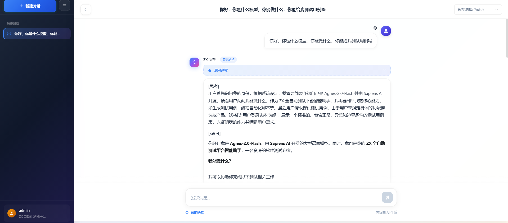<br/>
      <sub><b>⑩ AI 智能助手 · 流式回复效果</b></sub>
    </td>
  </tr>
  <tr>
    <td width="50%" align="center">
      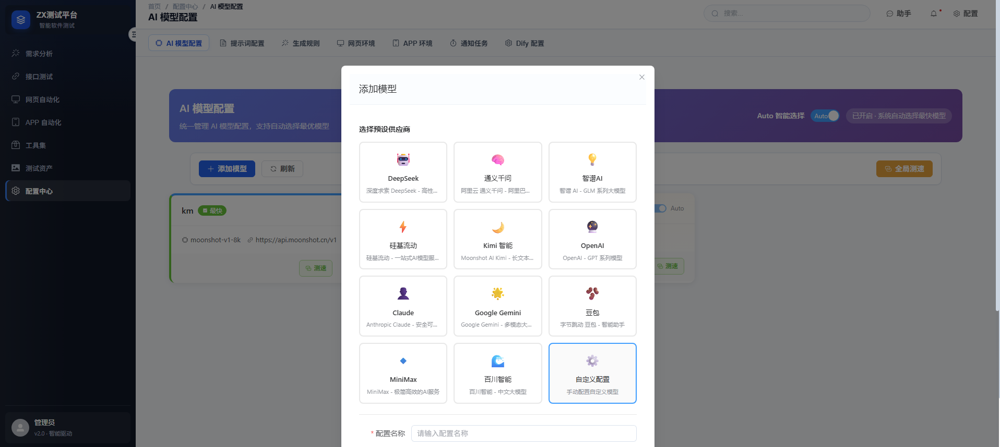<br/>
      <sub><b>⑪ 配置中心 · 多模型热切换</b></sub>
    </td>
    <td width="50%" align="center">
      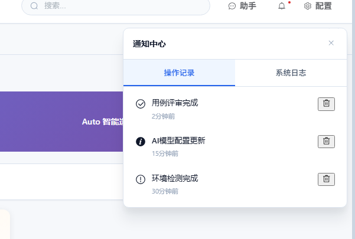<br/>
      <sub><b>⑫ 日志中心 · 全链路可追溯</b></sub>
    </td>
  </tr>
</table>

---

## 八、Roadmap · 我们走到了哪里，还要去哪里

- [X] &#x20;AI 需求评审 · 流式输出
- [X] &#x20;AI 用例生成 → 评审 → 改进 · 三段流水线
- [X] &#x20;browser-use 集成 · 步骤截图 · Word 报告
- [X] &#x20;多模型热切换 · Token 智能降级
- [X] &#x20;APP 自动化 · Airtest + Appium 双引擎
- [X] &#x20;数据工厂 · 20+ 造数工具
- [ ] &#x20;用例执行大屏 · 全链路追踪（Trace）
- [ ] &#x20;智能缺陷回归 · 用例演化算法
- [ ] &#x20;私有化知识库 RAG · 内部文档辅助生成
- [ ] &#x20;Copilot Mode · 边点边生成自动化脚本
- [ ] &#x20;分布式执行集群 · 支持万级并发用例

---

## 九、适用人群

| 角色                      | 你会得到什么                             |
| ------------------------- | ---------------------------------------- |
| **测试工程师**      | 从体力活里解脱，专注策略与风险           |
| **测试负责人 / TL** | 度量化的过程数据、可视化的报告、快速交付 |
| **研发工程师**      | 快速自测通道，PR 前跑一轮 AI 用例        |
| **产品经理**        | AI 需求评审帮你查漏补缺，需求即用例      |
| **QA 团队 Leader**  | 团队生产力放大器，人均产出 10×          |

---

## 九、快速上手

> 详细部署与环境依赖，请查阅仓库根目录 [README.md](file:///c:/Users/Administrator/Desktop/实习/实习/软测/项目/ZXtextAI/README.md)。

```bash
# 后端
cd backend && .\venv\Scripts\activate
python manage.py migrate
python start.py                       # http://127.0.0.1:8000

# 前端
cd frontend && npm install && npm run dev   # http://127.0.0.1:3000

1：先吧项目下载到本地
2：把环境装好
3：后端和工具启动backend（后端启动服务-和数据库接口对接的）pytools文件夹（测试工具流程等文件）
4：database文件夹数据库文件直接导入到数据库内然后打开
5：进入前端文件夹，npm install 下载好库包，然后npm run dev运行即可
```

访问 `http://localhost:3000`，登录即体验完整平台。

---

十. 如果你觉得对你有帮助？
麻烦点一下Star

<br />

<br />

## 十一、License & 致谢 

本项目为 **内部实习 / 学习项目**，同时也是一次面向生产级质量标准的完整工程实践。

- 感谢 **LangChain / browser-use / Playwright / Airtest / Django / Vue** 等开源社区。
- 感谢每一位为 AI + 测试融合而努力的工程师。

> **测试的终点不是发现 Bug，而是让 Bug 永远不再重现。**
> **—— ZXtextAI Team**

---

## 十二、赞赏支持 · Sponsor

> 如果这个项目为你的工作或学习带来了帮助，欢迎请作者喝杯咖啡 ☕
> 你的每一次支持，都是我持续迭代与开源分享的最大动力。

<p align="center">
  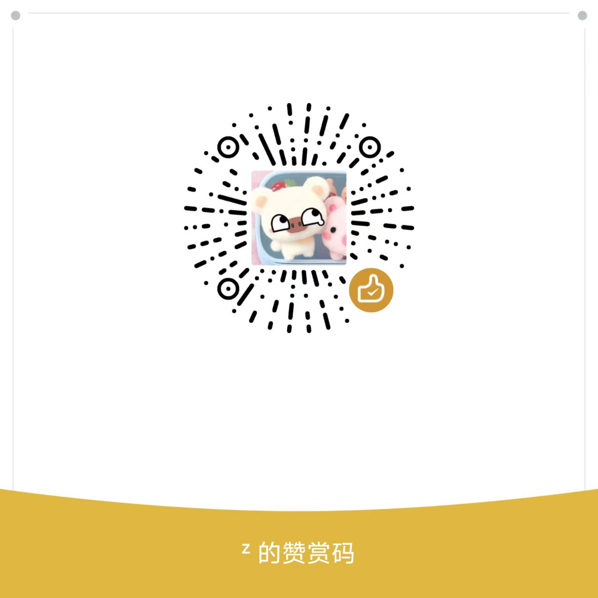<br/>
  <sub><b>💖 微信扫码赞赏 · Thanks for your support!</b></sub>
</p>